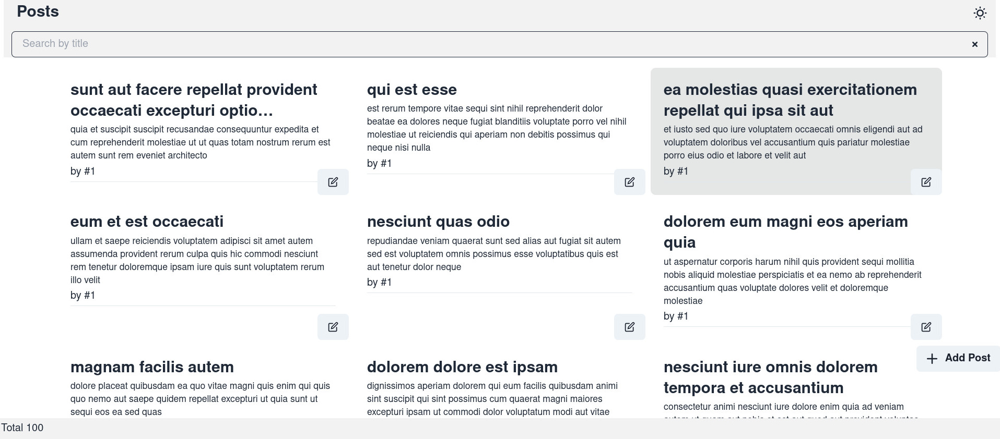
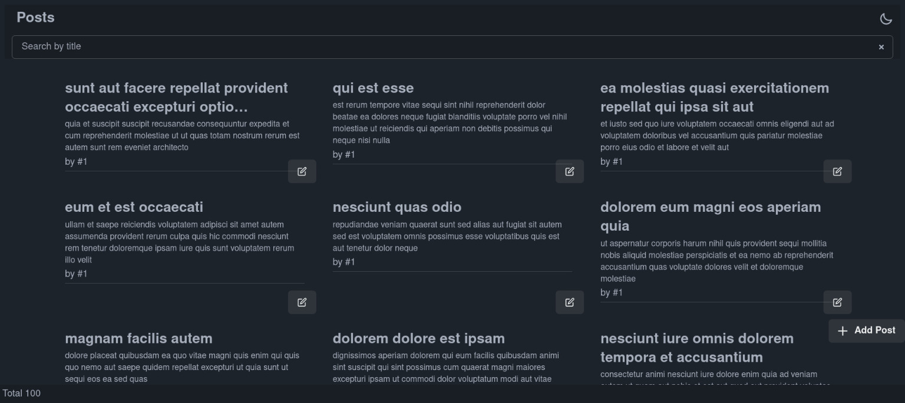
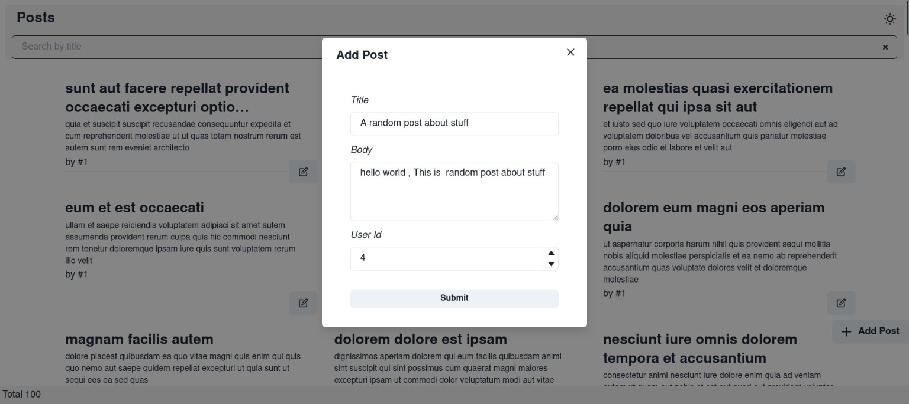
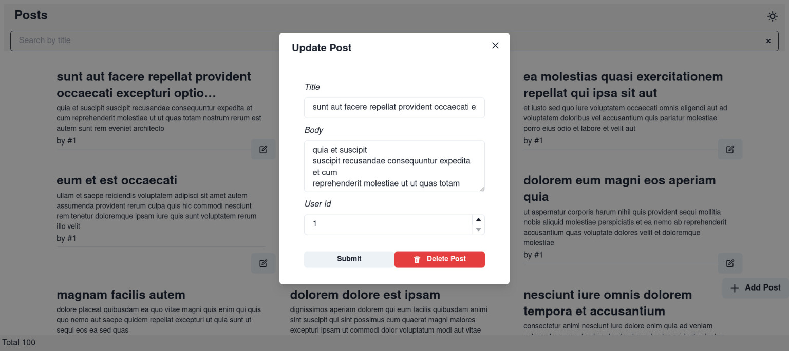

# PAYD Intern Assessment

## styling and design
 - I mostly used tailwindcss and daisyui for the thems and used chakarui for specific components like inputs and modals 
- since there's no easy way to make them share themes it's best to keep them separate and have separate mechanisms to trigger dark mode (they all seem to be using css variables but daisyui uses `data-theme` while chakra uses `class` , a helper to unite these 2 is possible)

## features

- list view with filtering and caching and suspensful data-fetching with react query



> [!NOTE]
> Filtering is being done by filtering the react-query cache and not by making a new query , since the filtering endpoint only filters by post ID which makes it hard to search for posts by title

```tsx
	const query = useSuspenseQuery({
		queryKey: ["posts"],
		queryFn: () => {
			return fetch("https://jsonplaceholder.typicode.com/posts").then(
				(res) => res.json() as Promise<Post[]>,
			);
		},
		select(data) {
			if (keyword) {
				return data.filter((post) =>
					post.title.toLowerCase().includes(keyword.toLowerCase()),
				);
			}
			return data;
		},
		staleTime: 1000 * 60 * 5,
	});
```

- add post modal 
  
- edit/delete post modal


> [!NOTE]
> The updates aren't persisted server side so i modify the local react query cache to display the changes 

```tsx
  const update_mutation = useMutation({
    mutationFn: updatePost,
    onMutate: (variables) => {
      qc.setQueryData(["posts"], (old: any) => {
        return old.map((post: Post) => {
          return post.id === variables.post.id ? variables.post : post;
        });
      });
      onClose();
    },})
```

- dark mode toggle

full video

<video controls src="short-clip.mp4" title="Title"></video>

